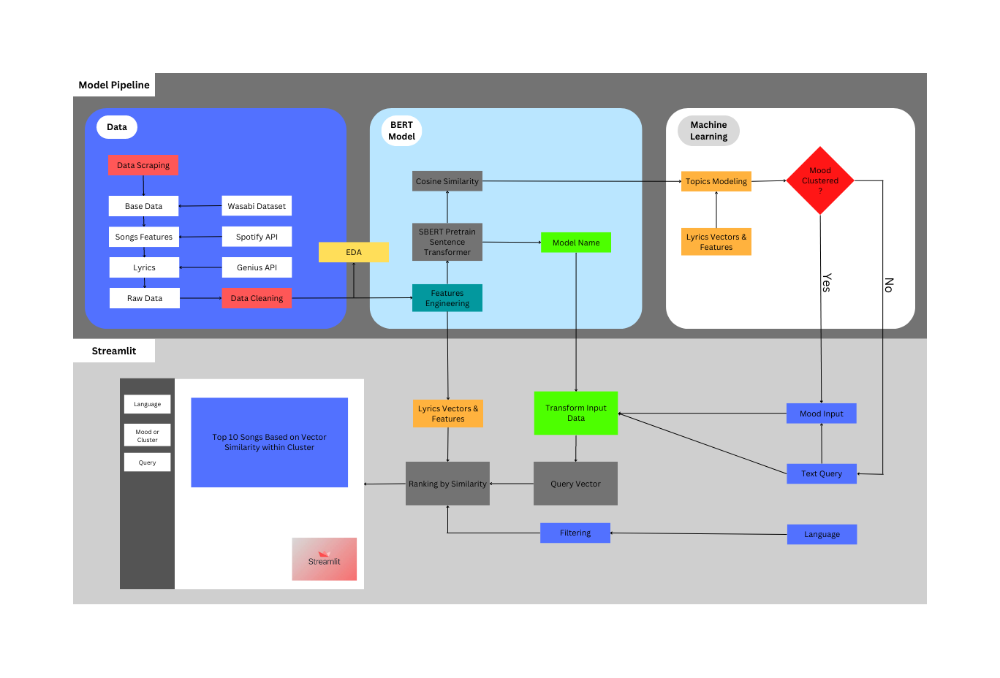

# Team-Spot-A-Mood
*Arthur Cho Ka Wai, Rodolfo Layedra, Poom Khorchitmate*\
This project is a part of data science capstone project at MADS, University of Michigan

## Project Overview
This project aims to provide song recommendations based on mood score and query to provide new musical experience to the users with the model being interfaced through streamlit. The project will rely on Information Retrieval System architecture based on similarity of the input provided by the user to the trained database of songs with the BERT model.

## Project Architecture
*Project status* **ACTIVE**\
\

## Getting Started
To start learning more about our project with our app, run the following steps
1. Clone this repository (for help, follow this [tutorial](https://help.github.com/articles/cloning-a-repository/))
2. Raw data is being kept [here](https://drive.google.com/drive/u/0/folders/1SuxyMLJ0Y9wRp1tKfo0sMVleT8TqK2Mj)
3. Create virtualenv  then run `pip install -r requirements.txt`
4. To start the streamlit app run `streamlit run app.py`

(some thoughts/ findings from Arthur)
## blog post outline:
1. motivation and overview: Improve media curation experience with semantically sensitive recommendation algorithms
2. recommender system: input/output relationships and ranking algorithm/ any related models and data
3. content affinity representation: semantic textual similarity/ nlp algorithms/ any related models and data
4. tooling: from notebook to an interactive tool/ any related technologies and services

## Generating similarity:

- lyrics can be a large input sequence (https://www.sbert.net/examples/applications/computing-embeddings/README.html#input-sequence-length) - should consider per line of per verse(https://huggingface.co/blog/playlist-generator#sentence-transformers-embeddings-and-semantic-search)

## Fine-tune model

Degrees of similarity for lyrics data
- lyrics text in the same song to have high similarity
- lyrics text in the same verse should have high similarity
- annotation text and the respective lyrics text portion should have high similarity
- lyrics text with same artist/ same song-writer to have high similarity