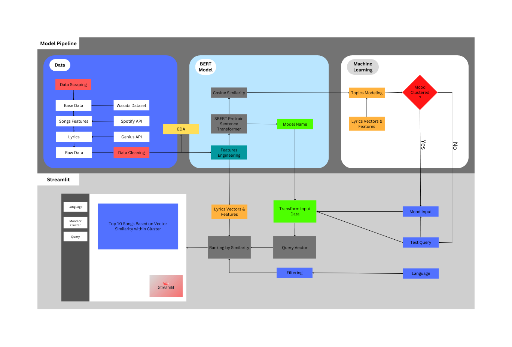
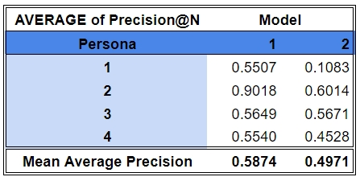

# Team-Spot-A-Mood
*Arthur Cho Ka Wai, Rodolfo Layedra, Poom Khorchitmate*\
This project is a part of data science capstone project at MADS, University of Michigan

# Table of contents

- [Table of contents](#table-of-contents)
- [Project Overview](#project-overview)
- [Project Architecture](#project-architecture)
- [Installation](#getting-started)
- [Usage](#usage)
- [Development](#development)
    - [Data Extraction and Preprocessing](#data-extraction-and-preprocessing)
    - [Information Retrieval Model](#information-retrieval-model)
    - [Fine-Tuned Model](#fine-tuned-model)
- [Ethical Questions/ Concerns](#ethical-questions-concerns)
- [Contributors](#contributors)

## Project Overview
This project aims to provide a new musical recommendation tool driven by semantic textual similarities between user text/image inputs and specific lines of song lyrics, as well as, a 2D network that allows users to explore similar songs with topics on the level of the overall lyrics. Top 10 songs with relevant lyrics results and graph showing showing adjacent lyrics lines are deliverd upon each user query. The tool can serve a broad audience who would like to find songs that match certain visual/textual queries, with specific lines that act like a punchline with respect to the query. 

Users can play with our Streamlit App at [Spot-A-Mood](https://huggingface.co/spaces/UMich-siads699-fa22-spotamood/spotamood) hugging face link here. 

The project will rely on an information retrieval architecture to encode user input (image/ text) and song lyrics documents based on pre-trained and fine-tuned Bidirectional Encoder Representations from Transformers (BERT) models using the Sentence Transformer (Reimers, 2022) Python framework.

Our recommendation generation components and related visualizations will be interfaced through Streamlit (Streamlit Inc., 2022), an open-source app framework for Machine Learning and Data Science initiatives. The overall architecture is illustrated in the diagram below: 

## Project Architecture
[(Back to top)](#table-of-contents)
*Project status* **ACTIVE**\
\

## Getting Started
[(Back to top)](#table-of-contents)
To start learning more about our project with our app, run the following steps
1. Clone this repository (for help, follow this [tutorial](https://help.github.com/articles/cloning-a-repository/))
2. Raw data is being kept [here](https://drive.google.com/drive/u/0/folders/1SuxyMLJ0Y9wRp1tKfo0sMVleT8TqK2Mj)
3. Create virtualenv  then run `pip install -r requirements.txt`
4. To start the streamlit app run `streamlit run app.py`

## Usage
[(Back to top)](#table-of-contents)

User can simply hit enter after you enter the text, or upload an image(an experimental function) to get started.

Our library contains information of 1000 'billboard top 100' songs at the moment. You can also refine the search scope by specifying a range of happiness level with the slider tool.

Recommendation is performed by a semantic textual similarity algorithm based on word embeddings generated by pretrained and fine-tuned models. Please refer to [the Model](https://github.com/treize-khushrenada/team-spot-a-mood/blob/main/App/pages/model.md) section for more details.

## Development
[(Back to top)](#table-of-contents)
<!-- process of development -->

### **Data Extraction and Preprocessing** 
***Dataset:***

Our team scraped song lyrics from Genius API (Miller, 2020) and song features from Spotify API (Lamere, 2022). The song list is based on the Wasabi dataset (Michael Fell, 2020), a large song corpus with metadata. We cannot directly use the Wasabi dataset, as the lyrics cannot be saved for download due to copyright issues. The available data are all trained embedding results. With a large corpus of over 2 million songs, we filtered out only songs with Spotify ID and from artists in the top 100 billboards since 1958. With the time limitation and the rate limit from APIs, we only work with 100,000 songs for our corpus of study.

***Data Cleaning:***

Our song’s lyrics are based on the Genius API which is community-curated content. Some song lyrics are extracted from a concert which contains a lot of spoken words by the singer. Some lyrics are just plain historical text. We notice that normal songs have line lengths that are not too long to fit within the song tempo, so we look for average and standard deviations of the songs’ line length and remove those that are over 2 standard deviations of the average range. More details about songs attibute can be found under the [Songs Attributes](https://github.com/treize-khushrenada/team-spot-a-mood/blob/main/App/pages/songs_attributes.md) section.

### **Information Retrieval Model** 
More details are under the [Model](https://github.com/treize-khushrenada/team-spot-a-mood/blob/main/App/pages/model.md) section.

***Feature Engineering and Embedding Generation:***

With our lyrics dataset, we first employed a pre-trained RoBERTa model (Yinhan Liu, 2019) through the Sentence Transformer framework to generate fixed-sized dense vectors. From the lyrics embeddings, we can then compare the transformed text query using the same model to find the embeddings’ similarity.
We will also fine-tune our model using the song lyrics and annotations from the Genius community as an attempt to generate embeddings that could have higher accuracy rates in terms of semantic similarity. More details about the data clustering can be found under the [Clustering](https://github.com/treize-khushrenada/team-spot-a-mood/blob/main/App/pages/clustering.md) section.

***Semantic Similarity:***

With all the embeddings generated from the models, a K-nearest neighbor model (KNN) is fit to the matrix, when a new embedding is generated from a user query, we could retrieve the top n candidates from the KNN model. We planned to use the widely-adopted cosine distance between the embeddings as the metric for semantic textual similarity  (Briggs, 2021).

***Results Ranking:***

We will incorporate compositional similarity scores in the ranked results, including overall song similarity score using average similarity from lyrics lines-user query pairs, as well as the scores of individual lines. To make the average similarity score more sensitive to sentences that are highly similar to a user query, we have made a function to penalize lines with low similarity scores.

***Fine-Tuned Model:*** 

we created a pair set of lyrics and annotations for each song extracted from the Genius API, which we then used to fine-tuned the pre-trained model. Annotations from the community were used in understanding that this will help the model expand its scope of lyrics comprehension. We expected this fine-tuned model to produce new embeddings for the same songs set as pre-trained models so that we can compare the performance of the recommendations of the two models as can be seen in the evaluation result. More information can can found in the [Model](https://github.com/treize-khushrenada/team-spot-a-mood/blob/main/App/pages/model.md) section.

***Findings and conclusions:***

The relevant score based on the recommendations for each personas can be found [HERE](https://docs.google.com/spreadsheets/d/14-rDjElKSgE7tY9WPnVKfQh8Xt4Wmcwfw1W3DnsS6SU/edit#gid=869230475)). The result shown in the table above indicated that the fine-tuned model performed worse than the pre-trained RoBerta model. Based on our limited number of songs and annotation pair of 1000 songs, it is possible the lyrics might be emphasizing some semantic meanings more than others. With this small training set, it can consequently lead to overfitting of the model trying to incorporate every semantic on the lyrics and annotation pairs (Espejel, 2022). Another explanation is that the lyrics and annotation pairs from the Genius API, which is community curated content, are not necessarily imply a match in the meanings. This would cause the fine-tuned model to learn unrelated pairs of meanings which result in poor embeddings. This can somewhat been seen in the clustering of the fine-tuned model, where the query embedding is far off from the cluster.

## Ethical Questions/ Concerns

***Negative Reinforcement*** 

First of all, an ethical challenge of recommendation algorithm would be the reinforcement of user intentions, which can put the users into a worse mood than they originally started with, or encouraging unethical behaviors, as similar content would be suggested to the users. We have addressed the concern by putting a disclaimer text in our app.

***Music Content*** 

Although the lyrics content was sourced from an open communitiy, copryright issues may still arise. Since we did not intend to provide full-text lyrics sharing and audio playback, only matched lyrics lines would be shown in the search results with credits to the Genius community, users can discover the full audio/ textual content of the song through other media channels.

## Contributors
[(Back to top)](#table-of-contents)

1. Arthur: Recommendation algorithm development, Front end implementation for text and image searching; Research on embeding-based semantic similarity embeddings and results ranking.
2. Rodolfo: Research, implementation, and evaluation of Fine-tuning pre-trained model tasks.
3. Poom (Miles) : Responsible for the data extraction from the songs API sources and data cleaning and preprocessing the lyrics embeddings. Also working on streamlit cluster visualizations as well as study and model pages.

## Resources
[(Back to top)](#table-of-contents)
1.      Lamere, P. (2022, Jun 26). Spotipy. From Read the Docs: https://spotipy.readthedocs.io/en/2.21.0/
2.  	Markelle Kelly, K. M. (2021, Feb). An Exploration of BERT for Song Classification and. From kaimalloy: https://kaimalloy.com/172B_Project.pdf
3.  	Michael Fell, E. C. (2020, Mar 15). Cornell University. From Arxiv: https://arxiv.org/abs/1912.02477
4.  	Miller, J. W. (2020). lyrics genius. From Read the Docs: https://lyricsgenius.readthedocs.io/en/master/
5.  	Reimers, N. (2022). Sbert.net. From Sentence-Transformer: https://www.sbert.net/docs/publications.html
6.  	Streamlit Inc. (2022). Streamlit. From Streamlit Documentation: https://docs.streamlit.io/
7.  	Yinhan Liu, M. O. (2019, Jul 26). RoBERTa: A Robustly Optimized BERT Pretraining Approach. From Arxiv: https://arxiv.org/abs/1907.11692
8.      Briggs, J. (2021). NLP similarity metrics | towards data science. Similarity Metrics in NLP, from https://towardsdatascience.com/similarity-metrics-in-nlp-acc0777e234c

